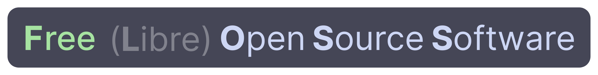

<h1 align="center">FOSS Alternatives</h1>

A exhaustive list of FOSS alternatives to proprietary software.

## 1. What is F(L)OSS?
Let this graphic teach you. 

**Free and open-source software** (**FOSS**) is software that is available under a license that grants the right to use, modify, and distribute the software, modified or not, to everyone free of charge. The public availability of the source code is, therefore, a necessary but not sufficient condition. FOSS is an inclusive umbrella term for [free software](https://en.wikipedia.org/wiki/Free_software "Free software") and [open-source software](https://en.wikipedia.org/wiki/Open-source_software "Open-source software").^[[a]](https://en.wikipedia.org/wiki/Free_and_open-source_software#cite_note-3)^ FOSS is in contrast to [proprietary software](https://en.wikipedia.org/wiki/Proprietary_software "Proprietary software"), where the software is under restrictive [copyright](https://en.wikipedia.org/wiki/Copyright "Copyright") or [licensing](https://en.wikipedia.org/wiki/Software_license "Software license") and the source code is hidden from the users.

**Source**: [Wikipedia](https://en.wikipedia.org/wiki/Free_and_open-source_software)

## 2. Alternatives for Desktop

## 3. Alternatives for Mobile